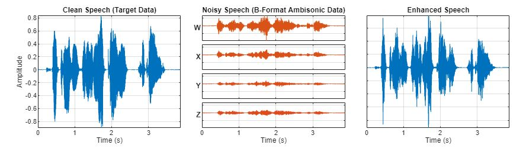
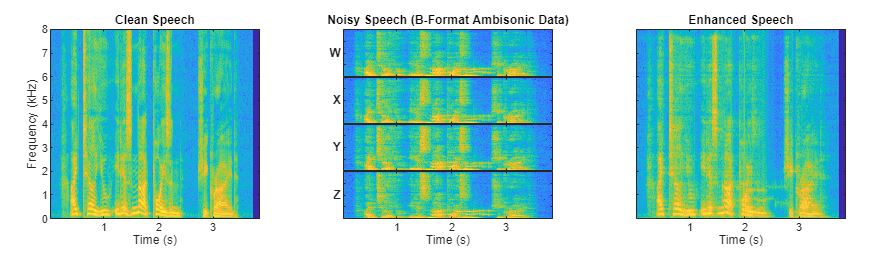
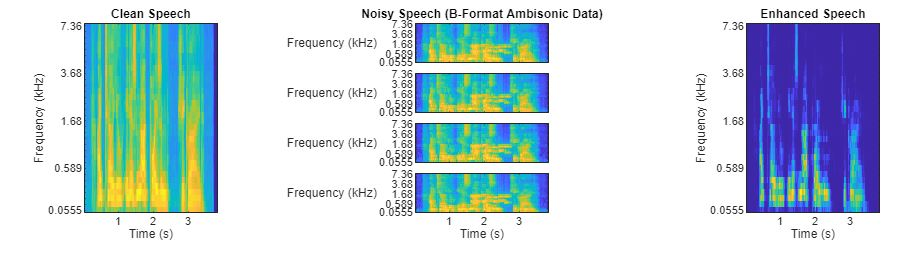

# 3-D-Speech-Enhancement-Network-using-L3DAS-2021-Dataset

I utilized the pretrained FaSNet model for speech enhancement, which operates as an end-to-end deep beamformer. This model processes B-format ambisonic
 audio recordings and outputs enhanced mono speech signals. To evaluate the results, I compared the clean speech, noisy (ambisonic) speech, and enhanced speech 
across three representations: time-domain waveforms, spectrograms, and mel spectrograms. Additionally, I performed speech-to-text transcription using the clean 
speech, ambisonic audio, and the enhanced output. The model demonstrated high accuracy in transcribing all versions, with notable improvements in transcription 
accuracy for the enhanced speech.

For more information about the model visit: https://ieeexplore.ieee.org/document/9003849

# Results-
Comparison of the clean speech, noisy speech, and enhanced speech in the time domain, as spectrograms, and as mel spectrograms.

